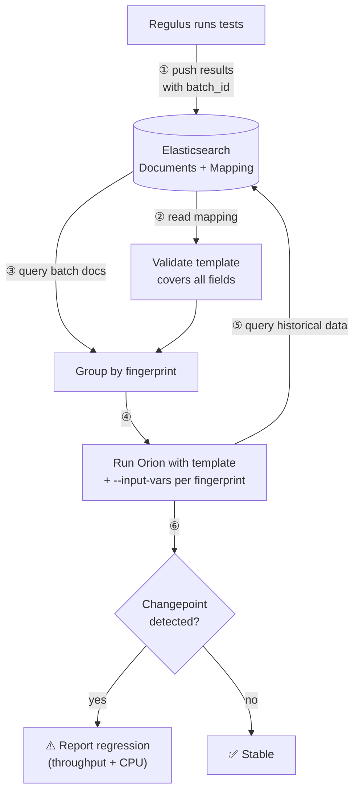

# Orion Regulus

Automated regression detection for Regulus network performance tests using [Orion](https://github.com/cloud-bulldozer/orion).

## Description

The "API" between Regulus and Orion — ES index content, mapping, fingerprint definitions, tracked metrics — is evolving. This tool lets us develop and test that API independently of the primary ci-tools/Prow environment, where iteration is slow and changes require step-registry PRs. Prow clones the Regulus repo and runs from `ORION/`.

**Source and sink are decoupled through the ES index mapping:**
- **Source (Regulus)** — pushes test results to ES. When fingerprint fields change (new fields added, fields renamed), Regulus updates the ES index mapping accordingly.
- **Sink (this tool)** — uses a static template (`configs/template.yaml`) defining all fingerprint fields. At startup, validates the template covers all ES mapping fields — exits with an error if the mapping has fields the template doesn't.

This means Regulus can evolve its test parameters — as long as the template is updated to match, the analysis side stays in sync. The startup drift check catches mismatches.

**How Orion and the data source work together:**



## Quick Start

```bash
# Install dependencies
make setup

# Set ES connection (persists to .makerc)
make set-es ES_URL=http://your-es:9200

# Analyze latest batch (auto-discover)
make analyze

# Analyze specific batch
make analyze BATCH_ID=test-batch-2026-07-08

# Cross-version analysis (ignore rcos from fingerprint)
make analyze BATCH_ID=test-batch-2026-07-08 IGNORE='rcos'

# Filter to specific tests within batch
make analyze BATCH_ID=test-batch-2026-07-08 MATCH='threads=128'
```

Run `make help` for all available targets.

## Tracked Metrics

Both metrics use `direction: 0` (flag changes in either direction):

| Metric | ES Field | Threshold | Detects |
|--------|----------|-----------|---------|
| `throughput` | `mean` | 5% | Throughput changes |
| `cpu_cost` | `busy_cpu` | 10% | CPU usage changes |

A fingerprint is flagged if **either** metric triggers a changepoint.

## Key Concepts

- **Fingerprint** — the set of fields that uniquely identify a test type. Defined in `configs/template.yaml`, validated against ES mapping at startup. See [FINGERPRINT-DEFINITION.md](FINGERPRINT-DEFINITION.md).
- **batch_id** — identifies which new tests to analyze (input selector, not part of fingerprint).
- **MATCH** and **IGNORE** — see [MATCH and IGNORE Filters](#match-and-ignore-filters) below.

## MATCH and IGNORE Filters

MATCH and IGNORE operate at different stages and serve different purposes:

**MATCH** — ES query filter. Narrows which documents are returned from Elasticsearch.

```bash
# Only analyze tests with threads=128
make analyze BATCH_ID=test-batch-001 MATCH='threads=128'
```

This adds `{"match": {"threads": "128"}}` to the ES query. Documents that don't match are excluded entirely.

**IGNORE** — Fingerprint field removal. Removes fields from the fingerprint definition, merging tests that would normally be analyzed separately into one time series.

By default, each unique combination of fingerprint fields (threads, rcos, kernel, etc.) is a separate fingerprint with its own independent analysis. IGNORE drops fields from that identity, so tests that differ only in the ignored fields share the same fingerprint and their samples combine into one longer time series.

```bash
# Group across rcos versions (cross-version analysis)
make analyze BATCH_ID=test-batch-001 IGNORE='rcos'

# Group across both rcos and kernel
make analyze BATCH_ID=test-batch-001 IGNORE='rcos kernel'
```

For example, without IGNORE, `threads=16, rcos=9.4` and `threads=16, rcos=9.6` are two separate fingerprints — each analyzed independently with its own history. With `IGNORE='rcos'`, they merge into one fingerprint (`threads=16`), combining their historical samples. This is how you detect regressions across version upgrades — the old and new rcos data form one time series, and Orion looks for a changepoint at the upgrade boundary.

**Using both together** — no conflict. MATCH filters at query time, IGNORE adjusts grouping after:

```bash
# Fetch only threads=128, group across rcos/kernel versions
make analyze BATCH_ID=test-batch-001 MATCH='threads=128' IGNORE='rcos kernel'
```

**Edge case:** `MATCH='threads=128' IGNORE='threads'` works fine. MATCH filters the query (only threads=128 docs returned), IGNORE removes threads from grouping (harmless since all docs already have the same value).

### Use Cases

Consider a batch with these tests in ES:

| threads | rcos | kernel | mean (Gbps) |
|---------|------|--------|-------------|
| 16 | 9.6 | 5.14.0-503 | 8.5 |
| 16 | 9.6 | 5.14.0-510 | 8.4 |
| 32 | 9.6 | 5.14.0-503 | 8.3 |
| 32 | 9.6 | 5.14.0-510 | 6.4 |
| 128 | 9.6 | 5.14.0-503 | 7.9 |
| 128 | 9.6 | 5.14.0-510 | 7.8 |

With no MATCH or IGNORE, each row is a separate fingerprint (unique by threads+kernel). Each has only 1 data point — too few for Orion to detect anything.

**1. Analyze one test from a batch** — a batch has many tests, you only care about one:

```bash
make analyze BATCH_ID=my-batch MATCH='threads=128'

# If multiple tests share threads=128, narrow further
make analyze BATCH_ID=my-batch MATCH='threads=128 protocol=tcp topology=internode'
```

**2. Cross-version comparison** — kernel 5.14.0-510 just rolled out. Without IGNORE, each kernel is a separate fingerprint with only 1 data point. With `IGNORE='kernel'`, Orion groups both kernels together per thread count (3 fingerprints, 2 data points each) and can detect that threads=32 dropped from 8.3 → 6.4:

```bash
make analyze BATCH_ID=post-upgrade-batch IGNORE='kernel'

# New kernel + new rcos at the same time
make analyze BATCH_ID=post-upgrade-batch IGNORE='rcos kernel'
```

**3. Investigate one test across versions** — threads=128 looks suspicious, compare across kernels:

```bash
# Isolates the 2 threads=128 rows, groups across kernel → 1 fingerprint, 2 data points
make analyze BATCH_ID=my-batch MATCH='threads=128' IGNORE='kernel'
```

**4. Debug a specific failure** — Prow flagged a regression on threads=32, drill in:

```bash
# Returns only the 2 threads=32 rows
make analyze BATCH_ID=failing-batch MATCH='threads=32'
```

**5. Broad sweep ignoring hardware differences** — tests ran on different hardware, group them to get more data points:

```bash
make analyze BATCH_ID=my-batch IGNORE='cpu arch'
```

**6. No match in batch** — if MATCH doesn't match any test in the batch (e.g., `MATCH='threads=256'` against the table above), the analyzer exits with code 3 ("no results to analyze"). Prow treats this as a non-failure.

## Testing

```bash
# Full test cycle: generate mock data → push to ES → analyze → validate
make test-full

# Test Prow CI entry point locally
make test-prow

# Re-validate last test results
make verify-test
```

Mock data includes 6 fingerprints covering: stable, throughput regression, throughput improvement, rcos mismatch, CPU-only regression, and multibench composite score regression.

## Installation

```bash
git clone https://github.com/redhat-performance/regulus.git
cd regulus/ORION
make setup    # installs orion + python dependencies
```

Requires Python 3.11+ and Elasticsearch/OpenSearch with Regulus test data.

## Prow CI Integration

Prow clones the Regulus repo and runs `ORION/scripts/prow-entry.sh`, which bridges Prow environment variables to `analyze-batch.py` CLI arguments. No bundled copy of the analyzer exists in the step registry — this directory is the single source of truth.

## Directory Structure

```
ORION/
├── scripts/
│   ├── analyze-batch.py          # Core analyzer (source of truth for dev and Prow)
│   ├── prow-entry.sh             # Prow CI entry point
│   ├── validate-test-results.sh  # Test expectations (single source of truth)
│   ├── verify-mapping.py         # Verify ES index mapping
│   ├── verify-batch.py           # Verify batch data quality
│   ├── list-batches.py           # List batch IDs in ES
│   └── run-it                    # Podman wrapper for Orion container
├── unit-test/
│   ├── generate-batch-test-data.py  # Generate mock test data (6 fingerprints)
│   ├── generate-mock-data.py        # Base mock data generator
│   └── json-to-bulk.py             # Convert JSON to ES bulk format
├── configs/
│   ├── template.yaml             # Static Orion config template (fingerprint source of truth)
│   ├── README.md                 # Config approach documentation
│   ├── CONFIG-TUTORIAL.md        # Orion config tutorial
│   └── DESIGN-TEMPLATE.md        # Template design doc
├── Makefile                      # All targets (make help)
├── CLAUDE.md                     # Project reference for Claude Code sessions
├── FINGERPRINT-DEFINITION.md     # Fingerprint field definitions
└── requirements.txt              # Python dependencies
```

## Documentation

- **[FINGERPRINT-DEFINITION.md](FINGERPRINT-DEFINITION.md)** — Fingerprint fields, tracked metrics, exclusion set
- **[configs/template.yaml](configs/template.yaml)** — Static Orion config template (fingerprint source of truth)
- **[configs/README.md](configs/README.md)** — Config approach and adding new fields
- **[configs/CONFIG-TUTORIAL.md](configs/CONFIG-TUTORIAL.md)** — How Orion configs work
- **[CLAUDE.md](CLAUDE.md)** — Project reference (architecture, pitfalls, Prow details)

## Author

Hugh Nhan (https://github.com/HughNhan)

Based on [Orion](https://github.com/cloud-bulldozer/orion) from the cloud-bulldozer team.
