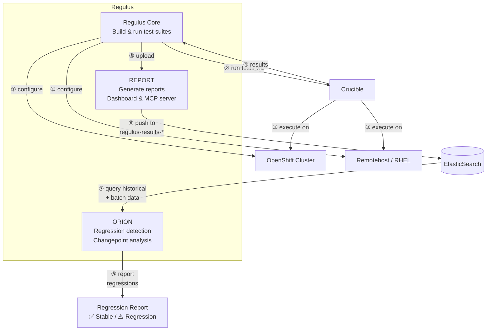
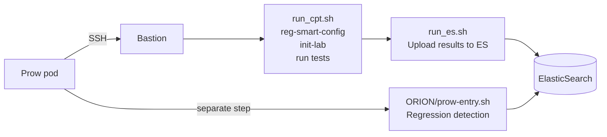

# Regulus

A framework for building and running [Crucible](https://github.com/perftool-incubator/crucible) network performance test suites, with automated reporting and regression detection. Supports OpenShift (pod-based) and remotehost (bare-metal) environments.

## Components



- **Regulus core** — Programmatically builds test recipes from templates (eliminating typos), organizes them into jobs, and executes them via Crucible. Supports OpenShift (pod-based) and remotehost (bare-metal) environments. Test groups live in `1_GROUP/`, `2_GROUP/`, `3_GROUP/`, and `DPDK_GROUP/`. `SETUP_GROUP/` contains configuration operations (PAO, SRIOV, etc.).

- **[REPORT](REPORT/)** — Report generation (JSON, HTML, CSV), interactive web dashboard, ElasticSearch integration for trend analysis, and an MCP server for AI-powered queries. See [README-report.md](README-report.md) for details.

- **[ORION](ORION/)** — Automated regression detection using [Orion](https://github.com/cloud-bulldozer/orion) changepoint analysis. Discovers test fingerprints dynamically from the ES index mapping, generates Orion configs per fingerprint, and reports throughput and CPU regressions. Integrated with Prow CI.

## Quick Start

### Prerequisites

1. Your Crucible controller is set up and working with your testbed.
2. Passwordless SSH from the Crucible controller to the bastion host: `ssh your-user@bastion-host` works.
3. Passwordless SSH from the bastion to itself: `ssh your-user@bastion-host` works from the bastion.
4. Passwordless SSH from the bastion to the first worker node: `ssh core@worker-0` works from the bastion. (Needed for `reg-smart-config` to discover CPU topology.)

### Step 1: Clone the repository

```bash
git clone https://github.com/redhat-performance/regulus.git
cd regulus
```

### Step 2: Configure your lab

```bash
cp lab.config.template lab.config
vi lab.config
```

You only need to set 3 values — `reg-smart-config` (next step) will auto-detect everything else:

```bash
export REG_KNI_USER=your-username      # Your username on the bastion host
export REG_OCPHOST="192.168.x.x"       # Bastion host IP address
export KUBECONFIG=/path/to/kubeconfig  # Path to your kubeconfig file
```

### Step 3: Bootstrap and auto-detect

```bash
# Set up environment variables
source ./bootstrap.sh

# Auto-detect NICs, topology, and workers — saves manual lab.config editing
bash bin/reg-smart-config

# Initialize lab infrastructure
make init-lab
```

`reg-smart-config` automatically detects:
- Worker nodes (OCP_WORKER_0, OCP_WORKER_1, OCP_WORKER_2)
- Available NICs and their models (CX6, CX7, E810, etc.)
- Suitable NICs for SRIOV, MACVLAN, and DPDK testing
- MTU settings
- OVN-Kubernetes primary interface (to avoid conflicts)
- Bare-metal hosts if available

**What it looks for:**
- NICs that are **UP** (cable connected)
- NICs that have **no IP address** (not in use)
- NICs that are **not used by OVN-K** (avoids conflicts)
- NICs with **recognized models**: XXV710, X710, E810, CX5, CX6, CX7, BF2, BF3

### Step 4: Verify configuration

```bash
cat lab.config | grep -E "WORKER|SRIOV|MACVLAN|DPDK|NIC_MODEL"
```

You should see something like:
```bash
export OCP_WORKER_0=worker-0.example.com
export OCP_WORKER_1=worker-1.example.com
export OCP_WORKER_2=worker-2.example.com
export REG_SRIOV_NIC=ens1f0np0
export REG_SRIOV_NIC_MODEL=CX6
export REG_MACVLAN_NIC=ens2f0
export REG_DPDK_NIC=ens3f0
export REG_SRIOV_MTU=9000
```

---

<details>
<summary>Manual Configuration (Advanced Users)</summary>

If the smart config doesn't detect your setup correctly, you can manually edit `lab.config`:

#### Understanding Your Network Topology

1. **OVN-K Primary Interface**: Which NIC is used by OpenShift's primary network
   ```bash
   oc debug node/worker-0
   chroot /host
   ip addr show | grep -A 5 br-ex
   ```

2. **Available NICs**: List all network interfaces
   ```bash
   oc debug node/worker-0
   chroot /host
   lspci | grep -i ethernet
   ip link show
   ```

3. **NIC Models**: Identify your hardware
   ```bash
   # Common models: Intel (XXV710, X710, E810), Mellanox/NVIDIA (CX5, CX6, CX7, BF3)
   ethtool -i ens1f0 | grep driver
   ```

#### Manual lab.config Parameters

```bash
# Required: Basic connection
export REG_KNI_USER=your-username
export REG_OCPHOST="192.168.x.x"
export KUBECONFIG=/path/to/kubeconfig

# Worker nodes
export OCP_WORKER_0=worker-0.example.com
export OCP_WORKER_1=worker-1.example.com
export OCP_WORKER_2=worker-2.example.com

# SRIOV Testing NIC (must not be OVN-K primary, must be UP, no IP assigned)
export REG_SRIOV_NIC=ens1f0np0
export REG_SRIOV_NIC_MODEL=CX6
export REG_SRIOV_MTU=9000

# MACVLAN Testing NIC (different from SRIOV)
export REG_MACVLAN_NIC=ens2f0

# DPDK Testing NIC (different from SRIOV and MACVLAN, no existing VFs)
export REG_DPDK_NIC=ens3f0

# Bare-metal hosts (optional)
export BMLHOSTA=bare-metal-1.example.com
export BMLHOSTB=bare-metal-2.example.com
```

</details>

---

## Running Tests

### Pilot test

Run a pilot test first to verify your setup:

```bash
# Add a simple test to jobs.config
vi jobs.config

# Initialize and run
make init-jobs
make run-jobs

# Clean up
make clean-jobs
```

Tip: shorten `DURATION` to 10 seconds and `NUM_SAMPLES` to 1 in `jobs.config` for a quick pilot.

### Testing scenarios

**Run a job of one or more test cases:**
```bash
vi jobs.config          # Add test cases to JOBS variable
make init-jobs
make run-jobs
make clean-jobs
```

**Run all test cases** (can take hours or days):
```bash
make init-all
make run-all
make clean-all
```

**Run a single test case directly:**
```bash
cd 1_GROUP/NO-PAO/4IP/INTER-NODE/TCP/16-POD
make init
make run
make clean
```

### Time considerations

Most test cases take a few minutes, but an iperf3 drop-hunter run can take several hours for its binary search. Adjust `DURATION` and `NUM_SAMPLES` in `jobs.config` — lower values for trial runs, higher values for production runs with better averages.

## Examine and Analyze Results

### Quick results check

In each test directory (e.g., `1_GROUP/NO-PAO/4IP/INTER-NODE/TCP/16-POD`), you'll find:
- **latest/** — All run artifacts and raw results

### Generate reports

```bash
# Generate comprehensive report (JSON, HTML, CSV)
make summary

# View results in interactive web dashboard
make report-dashboard    # Opens at http://localhost:5001

# Upload to ElasticSearch for trend analysis
make es-upload
```

### Regression detection

```bash
cd ORION

# Analyze latest batch for regressions
make analyze

# Analyze specific batch
make analyze BATCH_ID=test-batch-2026-07-08
```

See [ORION/README.md](ORION/README.md) for MATCH/IGNORE filters and detailed usage.

**For detailed reporting documentation, see:** [README-report.md](README-report.md)

## Prow CI Integration

In Prow, the entire workflow is automated via two scripts:

- **`run_cpt.sh`** — Main entry point called by the Prow step. Runs `reg-smart-config`, `make init-lab`, initializes jobs, executes tests, and then calls `run_es.sh` to upload results.
- **`run_es.sh`** — Uploads test results to ElasticSearch. Reads ES credentials from `lab.config` (written by the Prow step from mounted secrets), constructs the ES URL with URL-encoded credentials, and invokes the REPORT upload pipeline.



## Configure PAO and SRIOV

After `make init-lab` succeeds, configure PAO and SRIOV at the appropriate time. See README files in `PAO-config/` and `SRIOV-config/` for details.

## Customization

### lab.config

Lab-specific settings:
```bash
export REG_KNI_USER=myuser
export REG_OCPHOST="192.168.94.11"
export OCP_WORKER_0=appworker-0.blueprint-cwl.example.lab
export OCP_WORKER_1=appworker-1.blueprint-cwl.example.lab
export OCP_WORKER_2=appworker-2.blueprint-cwl.example.lab
export REG_SRIOV_NIC=ens1f0np0
export REG_SRIOV_MTU=9000
export REG_SRIOV_NIC_MODEL=CX6
```

### jobs.config

Job-specific settings:
```bash
export OCP_PROJECT=crucible-myproject
export JOBS=./1_GROUP/NO-PAO/4IP/INTER-NODE/TCP/2-POD
export DRY_RUN=false
export TAG=NOK
export NUM_SAMPLES=1
export DURATION=10
```

### reg_expand.sh

Customize test recipes in each test directory's `reg_expand.sh` file:
```bash
export TPL_SCALE_UP_FACTOR=1
export TPL_TOPO=internode
export TPL_INTF=eth0
```

### Templates

Add or modify templates at `$REG_ROOT/templates/`.

## Directory Structure

```
regulus/
├── 1_GROUP/, 2_GROUP/, 3_GROUP/  # Test case groups
├── DPDK_GROUP/                    # DPDK test cases
├── SETUP_GROUP/                   # Setup/configuration test cases
├── REPORT/                        # Reporting and analysis pipeline
├── ORION/                         # Regression detection (Orion integration)
├── bin/                           # Utilities (reg-smart-config, etc.)
├── templates/                     # Test recipe templates
├── common/                        # Shared scripts and functions
├── tools/                         # Maintenance tools
├── PAO-config/                    # Performance Addon Operator config
├── SRIOV-config/                  # SRIOV network config
├── MACVLAN-config/                # MACVLAN network config
├── DPDK-config/                   # DPDK network config
├── ADDONS/                        # Optional add-ons
├── lab.config                     # Lab-specific settings (user-edited)
├── jobs.config                    # Job definitions (user-edited)
├── bootstrap.sh                   # Environment setup
├── run_cpt.sh                     # Prow CI entry point
└── run_es.sh                      # ES upload script
```

## Author

Hugh Nhan (https://github.com/HughNhan)
